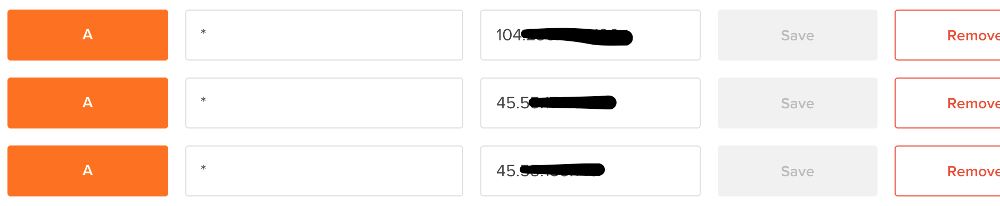

# mesoscloud-do

[](https://gitter.im/mesoscloud/mesoscloud-do?utm_source=badge&utm_medium=badge&utm_campaign=pr-badge&utm_content=badge)

[](https://waffle.io/mesoscloud/mesoscloud-do)

Create a mesoscloud on DigitalOcean.

## Getting Started

### 1

Generate a DigitalOcean Personal Access Token and update your environment.

*1.1*

https://cloud.digitalocean.com/settings/applications#access-tokens

*1.2*

```
export DIGITALOCEAN_ACCESS_TOKEN=<access-token>
```

Note that you can regenerate your access token at any time if you prefer not to save a copy.

### 2

Generate an SSH Key if you do not already have one.

```
test -e ~/.ssh/id_rsa || ssh-keygen -f ~/.ssh/id_rsa -N ''
```

### 3

You can clone mesoscloud-do now if you haven't already.  If you prefer, you can run the latest version of  mesoscloud.sh directly from github.

```
git clone git@github.com:mesoscloud/mesoscloud-do.git
cd mesoscloud-do
./mesoscloud.sh
```

OR

```
curl -fLsS https://raw.githubusercontent.com/mesoscloud/mesoscloud-do/master/mesoscloud.sh | sh
```

### 4

Take a look at `mesoscloud.cfg.current` in your current directory, this file represents the current configuration state and will be overwritten each time you run `mesoscloud.sh`.  If you want to persist configuration without relying solely on environment variables then you can create a `mesoscloud.cfg` file with content based on the values in `mesoscloud.cfg.current`.

Note:

- you may want to add `mesoscloud.cfg.current` to your `.gitignore` file to avoid accidentally committing secrets to your Git repo.
- if you are going to add your `mesoscloud.cfg` to source control consider *not* storing your digitalocean access token in `mesoscloud.cfg` and requiring that it be set via an environment variable

### 5

At this point you may choose to point a domain at one or more of your nodes using a wildcard DNS record.

https://cloud.digitalocean.com/domains



## Tutorials

### Using mesoscloud-do to create a mesoscloud on DigitalOcean

[](https://asciinema.org/a/25420)
